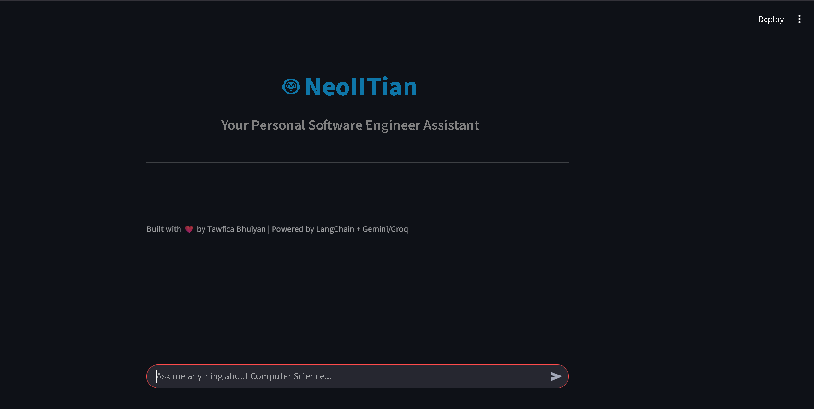
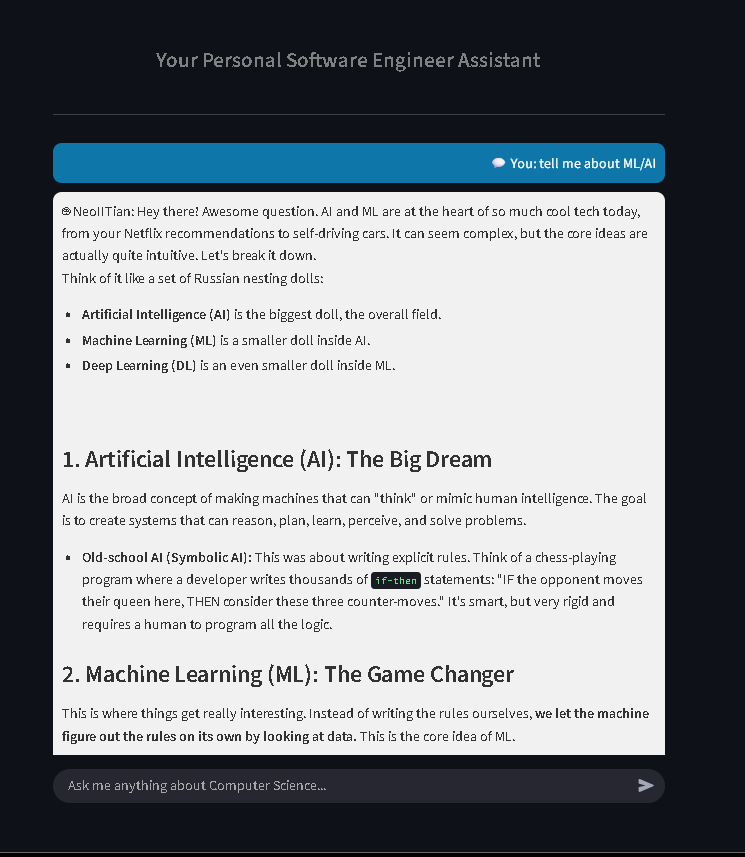
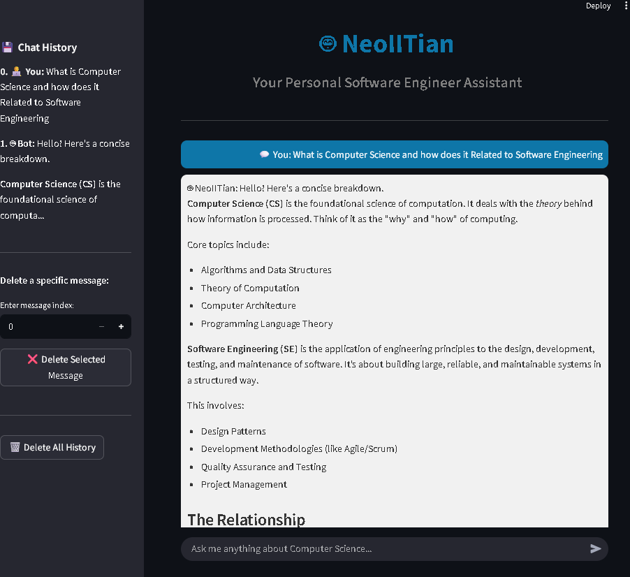

# 🤖 **NeoIITian – AI Software Engineer Chatbot**

  
_Your Personal AI Software Engineer Assistant_

---

## **🚀 About NeoIITian**

**NeoIITian** is a **smart, professional chatbot** designed to think and respond like a **top-tier Software Engineer**.  
It can answer **any Computer Science question** — from **programming, AI, ML, OS, DBMS, networks, to algorithms** — in a **structured, motivating, and clear way**.

Built with **[LangChain](https://www.langchain.com/)** + **[Gemini API](https://developers.generativeai.google/)**  
Developed in **Python** with a **modern Streamlit interface**.

---

## **🧩 Features**

- 💡 **Professional AI Software Engineer personality**
- 🧠 **Persistent chat history (auto-saved daily)**
- 💾 **Sidebar with chat history viewer**
- ❌ **Delete single message or full chat history easily**
- 🪄 **Context-aware, conversational memory**
- ⚡ **Fast, modular, and beginner-friendly codebase**
- 🌐 **Streamlit Web UI with elegant chat bubbles**
- 🔗 **Supports both Gemini and Groq LLM APIs**
- 🧰 **Simple file structure for easy customization**

---

## **📁 Project Structure**

```
NeoIITian/
├── .env.example           # Example environment variables
├── requirements.txt       # Python dependencies
├── README.md              # Project documentation
├── neo_iitian/
│   ├── main.py            # Streamlit Chat UI (now with history + delete options)
│   ├── chatbot.py         # Core chat logic (LLM response generator)
│   ├── llm_connector.py   # Gemini/Groq connector
│   ├── prompt_templates.py# Chatbot persona prompt
│   ├── utils.py           # UI helper (chat bubbles, etc.)
│   ├── config.py          # Environment setup
│   └── assets/logo.png    # Logo for UI & README
├── data/
│   └── sample_context.txt # Optional contextual knowledge base
└── docs/
    └── project_overview.md
```

---

## **⚙️ Setup Instructions**

### 1️⃣ Create Environment

```bash
conda create -n neoiitian python=3.10 -y
conda activate neoiitian
```

### 2️⃣ Install Dependencies

```bash
pip install -r requirements.txt
```

### 3️⃣ Set Environment Variables

Copy `.env.example` → `.env` and fill in your API keys:

```
GEMINI_API_KEY=your_gemini_api_key_here
LLM_PROVIDER=gemini
```

---

## **💬 How to Run NeoIITian**

### **Streamlit Web App**

```bash
streamlit run neo_iitian/main.py
```

Then open in browser → [http://localhost:8501](http://localhost:8501)

---

## **📸 Screenshots (To Add)**

1. 🏠 ### 🏠 Home Interface


2. ### 💬 Example Chat


3. ### 💬 Persistent Sidebar

     
---

## **🧠 Chat History Features**

NeoIITian now supports **persistent daily chat memory**:

✅ **Automatic saving:** Each session is saved as  
`chat_history_YYYY-MM-DD.json`  
✅ **Sidebar viewer:** See your past chat messages with role labels  
✅ **Delete options:**

- 🗑️ _Clear All_ – removes all messages
- ❌ _Delete One_ – choose and delete any message by index

---

## **💡 Example Questions**

```
- Explain process scheduling algorithms in OS.
- What is the difference between deep learning and ML?
- How does a database transaction work?
- What is Big O notation?
- How to debug Python code efficiently?
```

---

## **🎨 Streamlit Chat UI Highlights**

- 💬 Clean chat bubbles for user & NeoIITian
- 🔹 Cool **blue/gray** theme
- 🖼️ Custom **logo banner**
- 🕹️ Scrollable conversation area
- 📜 Sidebar to manage your history

---

## **🧭 Future Roadmap**

- 🔗 Vector DB integration (FAISS / Chroma / Pinecone)
- 🧍 Personalized user profile memory
- 🧩 Upload custom CS documents for context
- 🎙️ Voice-based Q&A (speech + TTS)
- 💻 Real-time code explaining & debugging

---

## **🛠️ Tech Stack**

| Layer       | Technology                      |
| ----------- | ------------------------------- |
| LLM Backend | Gemini API / Groq               |
| Framework   | LangChain                       |
| Frontend    | Streamlit                       |
| Language    | Python 3.10                     |
| Optional    | FAISS / Chroma (context memory) |

---

## **👨‍💻 Developer**

**Tawfica Bhuiyan** – AI/ML & LLM Enthusiast | Software Engineer in Progress  
📧 [bhuiyantawfica@gmail.com](mailto:bhuiyantawfica@gmail.com)  
🌐 [GitHub](https://github.com/TawficaBhuiyan)

---

## **⭐ Show Your Support**

If you find this project helpful or inspiring —  
please **⭐ Star it on GitHub** and share with your friends 🚀
